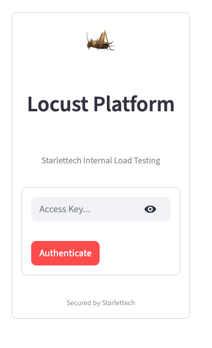
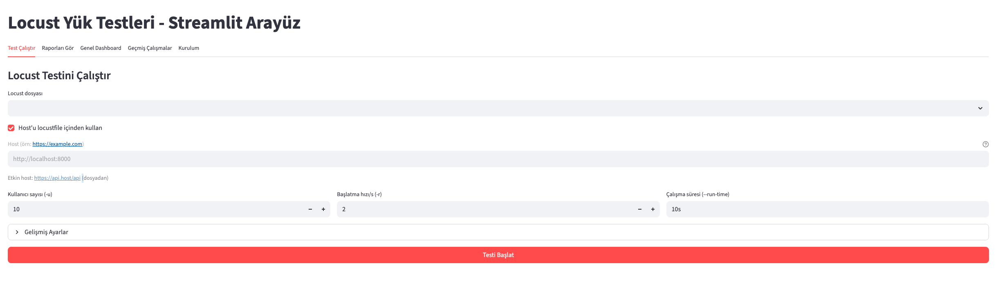
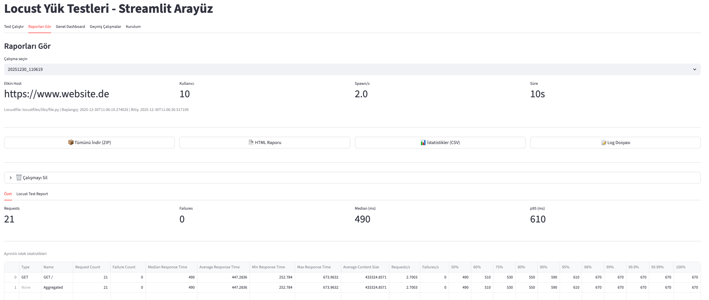
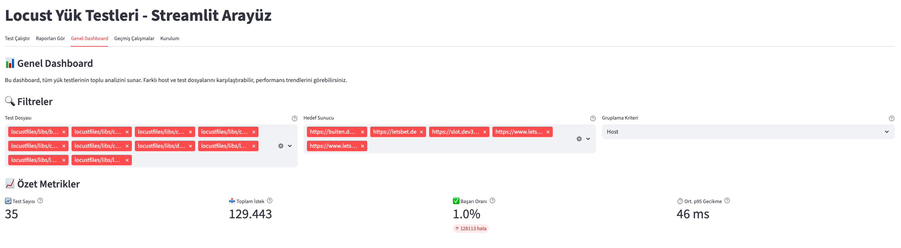

<div align="center">

# 🦗 Locust Web Manager
### The Modern Control Plane for Distributed Load Testing

[](https://opensource.org/licenses/MIT)
[](https://www.python.org/downloads/)
[](https://streamlit.io/)
[](https://locust.io/)
[](https://www.docker.com/)

**Scale your load tests with ease. Monitor in real-time. Analyze instantly.**

[View Demo](#screenshots) • [Get Started](#installation) • [Documentation](#configuration)

</div>

---

## 🚀 Why Locust Web Manager?

While Locust is amazing, managing distributed tests, history, and reporting across a team can be challenging. **Locust Web Manager** bridges the gap:

| Feature | Standard Locust UI | Locust Web Manager |
|---------|-------------------|-------------------|
| **Test Registry** | ❌ Manual file selection | ✅ **Dropdown UI** for all test files |
| **History** | ⚠️ Limited session only | ✅ **Persistent run history** (CSV/HTML) |
| **Reporting** | ⚠️ Basic HTML download | ✅ **Integrated ReportPortal** & Charts |
| ** CI/CD** | ❌ API driven | ✅ **Docker/Helm Ready** for K8s |

## ✨ Features

- **🧪 Smart Test Registry**: Automatically scans and lists all your Locust classes. No more command-line arguments.
- **📊 Real-time Dashboard**: Live streaming of logs, response times, and failure rates.
- **📝 Persistent History**: Every run is saved. Download past reports, CSVs, and logs anytime.
- **🔌 ReportPortal Native**: First-class integration with ReportPortal for enterprise-grade analytics.
- **☁️ Cloud Native**: Pre-configured `Dockerfile` and Helm charts for instant Kubernetes deployment.

## 📸 Screenshots

<!-- Tip: Drag and drop your screenshots here in the GitHub editor -->

### 1. Secure Access


### 2. The Command Center


### 3. Live Insights


### 4. Historical Analysis


## Prerequisites

- Python 3.10 or higher
- Locust installed
- (Optional) Docker & Kubernetes for deployment
- (Optional) ReportPortal instance for test result reporting

## Installation

### Local Installation

1. **Clone the repository:**
   ```bash
   git clone https://github.com/your-username/locust_app.git
   cd locust_app
   ```

2. **Install dependencies:**
   ```bash
   pip install -r requirements.txt
   ```

3. **Configure environment:**
   ```bash
   cp .env.example .env
   # Edit .env with your configuration
   ```

4. **Run the application:**
   ```bash
   streamlit run app.py
   ```

5. **Open your browser:**
   Navigate to `http://localhost:8501`

### Docker

1. **Build the image:**
   ```bash
   docker build -t locust-app .
   ```

2. **Run the container:**
   ```bash
   docker run -p 8501:8501 locust-app
   ```

3. **Access the UI:**
   Navigate to `http://localhost:8501`

### Kubernetes (Helm)

1. **Install/upgrade using Helm:**
   ```bash
   helm upgrade --install locust ./helm/locust \
     --namespace loadtest \
     --create-namespace \
     --set image.repository=your-registry.com/your-org/locust-app \
     --set image.tag=latest \
     --set extraEnv[0].name=RP_TOKEN \
     --set extraEnv[0].value=$RP_TOKEN \
     --set extraEnv[1].name=RP_ENDPOINT \
     --set extraEnv[1].value=$RP_ENDPOINT \
     --set extraEnv[2].name=RP_PROJECT \
     --set extraEnv[2].value=$RP_PROJECT
   ```

2. **Access the application:**
   Configure ingress or port-forward to access the Streamlit UI

## Configuration

### Environment Variables

| Variable | Description | Default |
|----------|-------------|---------|
| `LOCUST_HOST` | Target host for load tests | `https://localhost:8080` |
| `LOCUST_TARGET_HOST` | Override host from locustfile | - |
| `LOCUST_USERS` | Default number of users | `10` |
| `LOCUST_SPAWN_RATE` | Default spawn rate (users/s) | `2.0` |
| `LOCUST_RUN_TIME` | Default run time | `10s` |
| `LOCUST_CSV_PREFIX` | CSV file prefix | `stats` |
| `LOCUST_HTML_REPORT` | Generate HTML report | `True` |
| `LOCUST_CSV_FULL_HISTORY` | Enable full CSV history | `True` |
| `RP_ENDPOINT` | ReportPortal endpoint URL | - |
| `RP_PROJECT` | ReportPortal project name | - |
| `RP_TOKEN` | ReportPortal API token | - |
| `RP_LAUNCH_NAME` | Default launch name | `Locust Load Test` |
| `RP_DESCRIPTION` | Launch description | `Load Test from Locust` |
| `RP_TEST_HOST` | Target host for RP reports | - |
| `RP_HOST_SOURCE` | Host source label (UI/file) | `unknown` |
| `RP_LOCUSTFILE` | Locustfile name for RP | `Unknown` |
| `RP_DETAILED_LOG` | Enable detailed RP logging | `False` |
| `RUNS_DIR` | Directory for test results | `runs` |
| `LOCUSTFILES_DIR` | Directory containing locustfiles | `locustfiles` |
| `LOCUSTFILES_SUBDIR` | Subdirectory for test files | `libs` |
| `APP_PASSWORD` | UI authentication password | - |

### ReportPortal Setup

1. Set `RP_ENDPOINT`, `RP_PROJECT`, and `RP_TOKEN` in `.env`
2. Enable "ReportPortal Integration" checkbox in UI
3. Test results will be automatically uploaded

## Usage

### Running Tests

1. Navigate to **"Run Test"** tab
2. Select a locustfile from the registry
3. Configure host, users, spawn rate, and run time
4. Click **"Start Test"**
5. Monitor live logs during execution

### Viewing Reports

1. Navigate to **"View Reports"** tab
2. Select a test run from dropdown
3. View summary statistics, charts, and CSV data
4. Download HTML report, CSV files, or full ZIP archive

### Dashboard Analytics

1. Navigate to **"Global Dashboard"** tab
2. Filter by test file or target server
3. Compare performance metrics across multiple runs
4. View aggregated statistics and trends

### History

1. Navigate to **"History Runs"** tab
2. View all recorded test runs
3. Check availability of CSV and HTML reports

## Architecture

```
locust_app/
├── app/
│   ├── core/                 # Core logic
│   │   ├── settings.py      # Pydantic settings
│   │   ├── config.py        # Configuration
│   │   ├── runner.py        # Locust subprocess management
│   │   ├── data.py          # Data loading & caching
│   │   ├── rp_listener.py   # ReportPortal integration
│   │   └── hooks.py        # Locust event hooks
│   └── ui/                   # Streamlit UI
│       ├── main.py          # Main entry point
│       ├── auth.py          # Authentication
│       ├── charts.py        # Plotly visualizations
│       └── tabs/           # UI tabs
│           ├── run_tab.py       # Run test interface
│           ├── dashboard_tab.py # Global dashboard
│           ├── reporting_tab.py # Report viewer
│           ├── history_tab.py   # History list
│           └── setup_tab.py     # Setup instructions
├── locustfiles/               # Locust test files
│   ├── utils/
│   │   ├── base_user.py     # BaseLocustUser class
│   │   └── log_utils.py     # Logging utilities
│   └── files/               # Your test files
├── helm/locust/              # Kubernetes Helm chart
│   ├── Chart.yaml
│   ├── values.yaml
│   └── templates/           # K8s manifest templates
├── Dockerfile               # Streamlit UI container
├── k8s.Dockerfile          # Optimized container for K8s
├── requirements.txt
└── .env.example
```

## CI/CD

### Bitbucket Pipelines

The project includes Bitbucket Pipelines configuration for:
- Building Docker images
- Pushing to container registry
- Deploying to Kubernetes via Helm

See [bitbucket-pipelines.yml](bitbucket-pipelines.yml) for details.

### GitHub Actions (Recommended)

Create `.github/workflows/ci.yml`:

```yaml
name: CI

on:
  push:
    branches: [ main, develop ]
  pull_request:
    branches: [ main ]

jobs:
  test:
    runs-on: ubuntu-latest
    steps:
      - uses: actions/checkout@v4

      - name: Set up Python
        uses: actions/setup-python@v5
        with:
          python-version: '3.10'

      - name: Install dependencies
        run: |
          python -m pip install --upgrade pip
          pip install -r requirements.txt

      - name: Lint with flake8 (if available)
        run: |
          pip install flake8
          flake8 . --count --select=E9,F63,F7,F82 --show-source --statistics

      - name: Run Streamlit app test
        run: |
          streamlit run app.py --server.headless true --server.port 8501 &
          sleep 10
          curl -f http://localhost:8501 || exit 1
```

### Jenkins Pipeline (Optional)

Create `Jenkinsfile`:

```groovy
pipeline {
    agent any

    environment {
        DOCKER_IMAGE = 'locust-app'
        REGISTRY = 'your-registry.com'
    }

    stages {
        stage('Checkout') {
            steps {
                checkout scm
            }
        }

        stage('Build Docker Image') {
            steps {
                sh "docker build -t ${DOCKER_IMAGE}:${BUILD_NUMBER} ."
                sh "docker tag ${DOCKER_IMAGE}:${BUILD_NUMBER} ${DOCKER_IMAGE}:latest"
            }
        }

        stage('Test') {
            steps {
                sh "docker run --rm ${DOCKER_IMAGE}:${BUILD_NUMBER} streamlit version"
            }
        }

        stage('Deploy') {
            when {
                branch 'main'
            }
            steps {
                sh "helm upgrade --install locust ./helm/locust --namespace loadtest"
            }
        }
    }
}
```

## Development

### Project Structure

- **Core Layer** (`app/core/`): Settings, Locust runner, data loading, ReportPortal listener
- **UI Layer** (`app/ui/`): Streamlit interface with tabs for different features
- **Locustfiles** (`locustfiles/`): Base user class and utilities for writing tests

### Adding New Locust Tests

1. Create a new Python file in `locustfiles/files/` or `locustfiles/libs/`
2. Inherit from `BaseLocustUser` class
3. Define `@task` decorated methods
4. Test will automatically appear in UI registry

Example:

```python
from locustfiles.utils.base_user import BaseLocustUser
from locust import task, between

class MyUser(BaseLocustUser):
    wait_time = between(1, 3)

    @task
    def my_task(self):
        with self.client.get("/api/endpoint", catch_response=True) as response:
            self.validate_response(response, expected_status=200)
```

## Contributing

We welcome contributions! Please follow these steps:

1. Fork the repository
2. Create a feature branch (`git checkout -b feature/amazing-feature`)
3. Commit your changes (`git commit -m 'Add amazing feature'`)
4. Push to the branch (`git push origin feature/amazing-feature`)
5. Open a Pull Request

See [CONTRIBUTING.md](CONTRIBUTING.md) for detailed guidelines.

## License

Distributed under the MIT License. See [LICENSE](LICENSE) for more information.

## Acknowledgments

- [Locust](https://locust.io/) - Modern load testing framework
- [Streamlit](https://streamlit.io/) - Python web app framework
- [ReportPortal](https://reportportal.io/) - Test result reporting platform
- [Plotly](https://plotly.com/) - Interactive visualization library
- [Pandas](https://pandas.pydata.org/) - Data manipulation library
